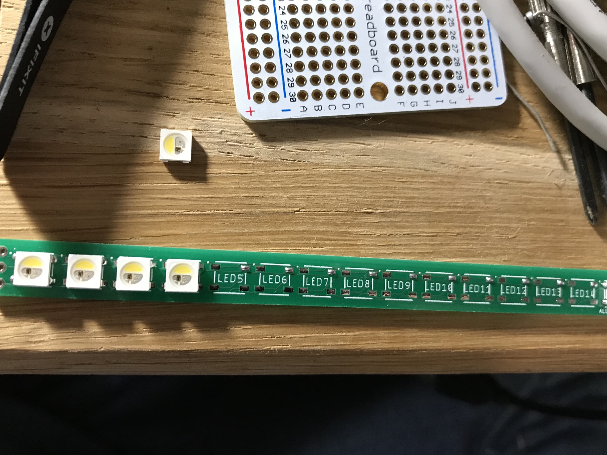
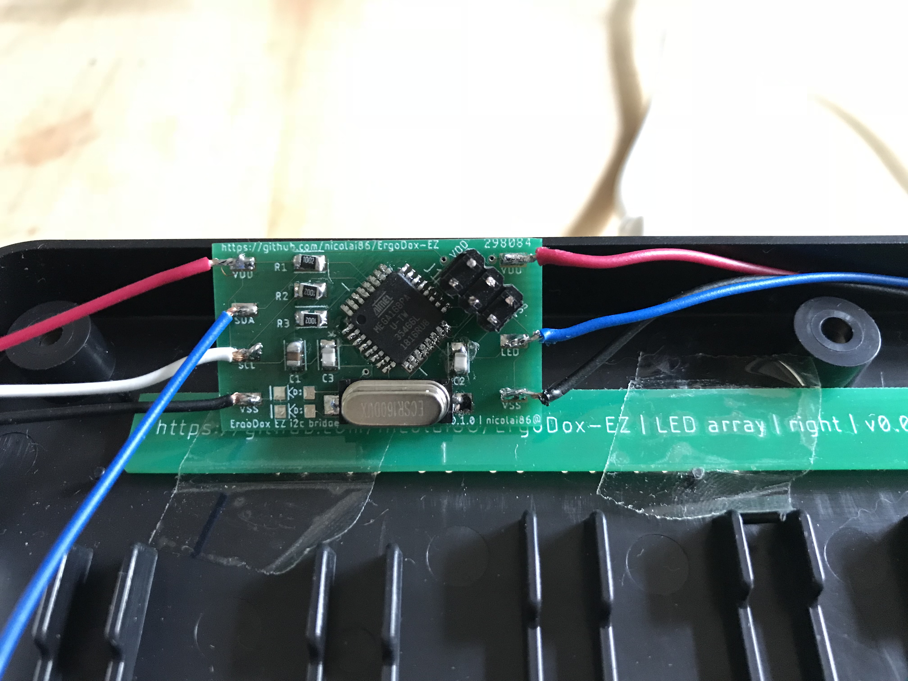

# ErgoDox-EZ

[ErgoDox EZ](https://ergodox-ez.com/) LED mod to convert your regular ErgoDox EZ into an ErgoDox EZ shine.  
The total cost for this mod is about about 40 CAD (~30 CAD for PCBs, ~10 CAD for components)

## Instructions

To build this mod you need to assemble two LED strips, and one I2C bridge. The LED strips are installed on both sides. The right hand LED strip is directly connected to the main PCB. The left hand LED strip requires an I2C bridge to function.

## Firmware

Once you've connected your Atmega168 you can compile the firmware and flash your microcontroller with the included makefile:

```
$ make build
$ make flash
```

The makefile is setup to use the AVR ISP MKII.

## LED strip

You will need to LED pcbs to build this mod. The LED strips are identical for both sides.

### List of materials

| Component | Amount        | Notes |
|-----------|:-------------:|------:|
| RGBW6812  | 30            | 15 per side; Can be ordered at Aliexpress |
| 3-pin micro JST connector | 1 | right hand connector to main PCB |

The gerber files, eagle project schematics and board files are included in the led-strip folder.

### Assembly

The LED strip assembly needs to be done twice, once for each half. For each side:

1. Solder all 15 RGBW SK6812 LEDs 
2. Solder the cables according to the marks




For the right hand you can solder the cables to the keyboard, or use a 3-pin micro JST connector instead.
The left hand needs to be connected to an I2C bridge:

## I2C bridge

### List of materials

| Component | Amount        | Notes |
|-----------|:-------------:|------:|
| atmega168pa-au  | 1       | Required to decode I2C traffic |
| 0805 22pF cap   | 2       | |
| 0805 10uF cap   | 1       | |
| 0805 10K resistor | 3     | |
| CSM-7X-DU 16Mhz oscillator | 1     | |
| 6 pin AVR ISP connector | 1     | |
| 4-pin micro JST connector | 1 | left hand connector to main PCB |

The gerber files, eagle project schematics and board files are included in the i2c-bride folder.

## Assembly

1. Solder the Atmega168p. Make sure to align the dark circle with the PCB properly. I've used SMD solder paste to place a film over all pins, solder one pin at a time.
2. Solder the 2 22pF caps, C3 and C2.
3. Solder the oscillator. 
4. Solder the 10uF cap.
5. Solder the 3 10k res.
6. Solder the jack. Note that you'll need to desolder it after flashing, or cut them off.

The left hand will look like this after soldering:


